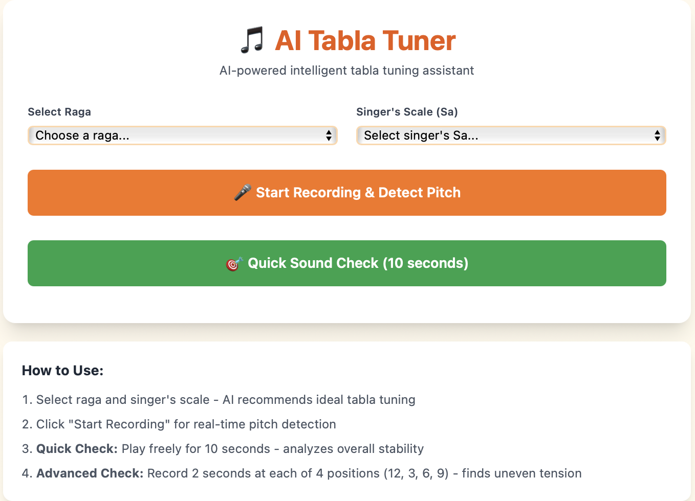
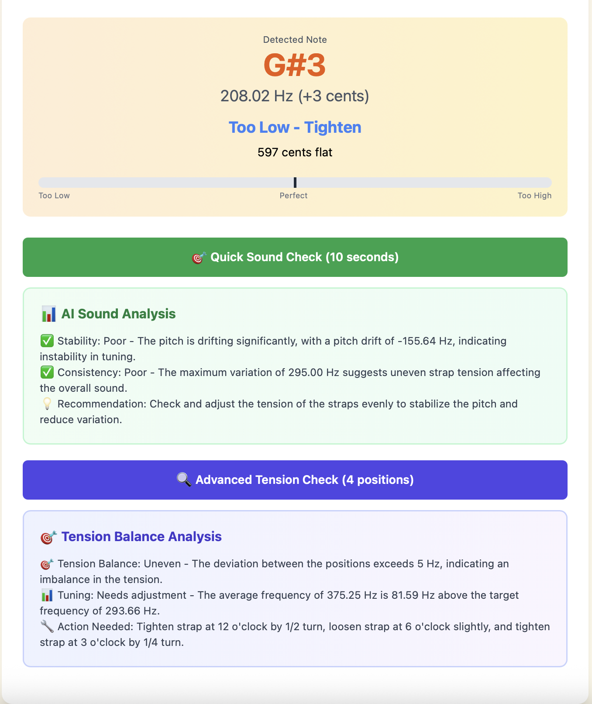

# Building an AI Tabla Tuner: Real-Time DSP Meets Classical Percussion

I have played tabla for more than fifteen years, and one thing has always bothered me more than it should: tuning. On a good day, the drum “feels” right. On a bad day, the pitch wanders, the tension is uneven, and every stroke sounds like it belongs to a different instrument. The problem isn’t lack of experience—tabla tuning is inherently complex.  

Most digital tuners are built for guitars or vocals. They assume a stable harmonic structure, a long sustained signal, and a clear fundamental. Tabla strokes violate all of those assumptions. The result is that common tuners often give inconsistent or flat-out incorrect readings.

So I decided to build the tool I always wished existed:  
**an AI-assisted tabla tuner that understands percussion physics, analyzes pitch stability, evaluates tension balance, and recommends musically appropriate tuning based on raga and Sa.**

Live demo: https://aituning.netlify.app  
Source code: https://github.com/trinav-code/tabla-tuner

---

## Why This Project Exists

This project started for a very personal reason: I wanted to remove the guesswork in my own tuning process. Over time the goal expanded into something more ambitious—could I get a browser to “understand” tabla sound well enough to help students, performers, or anyone learning the instrument?

A good tabla tuning companion should:

- Detect the *true* fundamental, not a harmonic.
- Track tuning stability during free playing, not just isolated strokes.
- Detect when one side of the drum is tighter than the other.
- Recommend the correct pitch based on the performance’s raga and Sa.
- Provide feedback that a human musician would actually find useful.

That became the design philosophy for this tool.

---

## Interface Overview

### 1. Starting Screen: Select Raga and Sa

The first step is telling the tuner the musical context: the raga and the singer’s Sa. These two pieces of information determine what pitch the tabla *should* be tuned to—often Sa or Pa, depending on the raga’s vadi, samvadi, and tonal center.



This alone solves a common problem for beginners who know how to tune but are unsure what note they should aim for in different ragas.

---

### 2. Real-Time Pitch Detection

Once the microphone activates, the tuner begins streaming and analyzing audio continuously. Tabla strokes are short and rich in harmonics, so the system uses peak selection and smoothing logic that focuses on the correct spectral region.


The UI presents:

- The detected note  
- Frequency in Hz  
- Cent deviation  
- A simple suggestion like “Too low, tighten”  
- A visual pitch bar for quick reference  

Even this basic detection had to be more robust than standard tuners, since tabla strokes decay quickly and contain several competing peaks.

---

### 3. Quick Sound Check: Stability and Consistency

This is the part I personally find most useful. The Quick Check records ten seconds of real playing—not isolated strokes—and evaluates how the pitch behaves over time.



It computes:

- Average pitch  
- Pitch drift  
- Maximum variation  
- Degree of stability  
- Signs of uneven tension  
- Tuning difference from the target note  

It then summarizes the results in a way that resembles how a teacher might give feedback: not overly technical, but specific enough to guide adjustments.

---

## Technical Breakdown

### Real-Time Audio Pipeline

The tuner is powered by the Web Audio API, which provides raw microphone access in the browser. The audio samples pass through an FFT with the following design considerations:

- **Window size** balanced for precision and responsiveness  
- **Harmonic cleaning** to prevent locking onto overtones  
- **Parabolic interpolation** for sub-Hz accuracy  
- **Temporal smoothing** to reduce jitter without hiding meaningful variation  

Traditional pitch detection algorithms assume sustained tones. Tabla strokes required an approach that was less sensitive to short transients and more aware of harmonic patterns.

---

### Raga-Aware Tuning Logic

The note recommendation system uses curated raga information:

- Vadi and samvadi  
- Strong scale degrees  
- Context for Sa, Pa, Re as tuning bases  

For example, in Kafi, Pa aligns well with the raga’s structure and is often the preferred tabla tuning. The tool incorporates these musical heuristics automatically, removing a layer of uncertainty for performers.

---

### Stability and Tension Analysis

The Quick Check evaluates time-series pitch behavior. Large drift indicates unstable tension or inconsistent striking technique. High variance suggests strap imbalance or a drum that is out of round.

The **12–3–6–9 test** (Advanced Tension Check) compares four pitch measurements around the drum to evaluate symmetry. Significant differences imply uneven tension. Because tabla tone is extremely sensitive to strap distribution, this helps diagnose mechanical issues that are hard to detect by ear.

---

### Architecture and Philosophy

The entire tool runs client-side:

- **React** for UI and interaction  
- **Web Audio API** for DSP  
- **Lightweight analysis layer** for interpreting pitch behavior  
- No backend, no server round-trips  

Everything stays local to the browser to ensure privacy and low latency. The design goal was to make the tool simple enough for a student to use, yet accurate enough for a performer to rely on before a concert.

---

## How to Try It

Online version:  
https://aituning.netlify.app

Local setup:

```bash
git clone https://github.com/trinav-code/tabla-tuner
cd tabla-tuner
npm install
npm run dev
